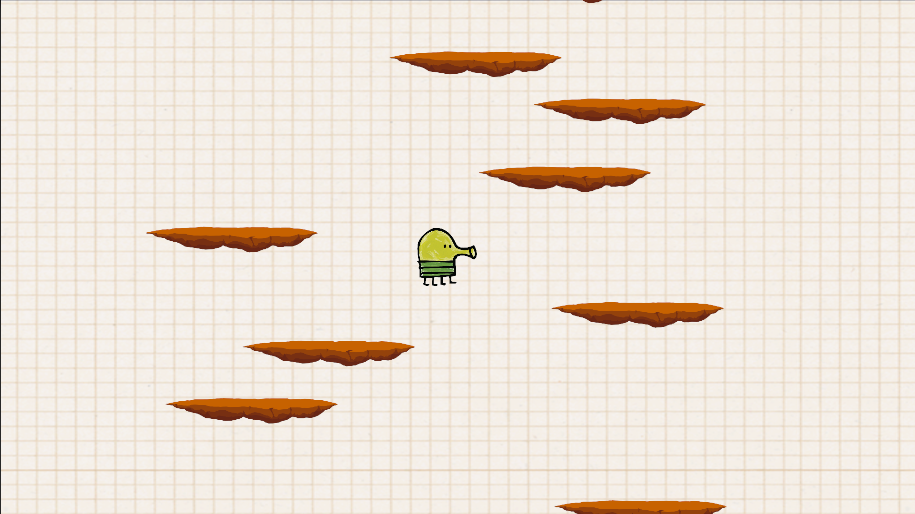

# 🎮 One Button Game - Doodle Jump
Un jeu de plateforme inspiré de Doodle Jump, développé sous Unity.

# 🚀 Fonctionnalités
Gameplay simple et amusant. 
Génération aléatoire des plateformes : Chaque partie est unique. 
Obstacles : Évitez les pièges et montez le plus haut possible ! 

# 🎮 Comment jouer ?
Lancez le jeu. 
Utilisez les flèches gauche et droite pour diriger le personnage. 
Atterrissez sur les plateformes pour continuer à grimper. 
Évitez les obstacles et essayez d’aller le plus loin ! 

# 🛠️ Technologies utilisées
Moteur de jeu : Unity 
Langage : C# 
Physique : Unity Physics 

# 📌 Installation
Clonez le repo : 
git clone https://github.com/thomascrecy/one-button-game.git  
Ouvrez le projet avec Unity. 
Lancez le jeu depuis l’éditeur ou exportez-le pour votre plateforme préférée. 

# Remerciment 
Thomas Crecy et Yanice Hourcade